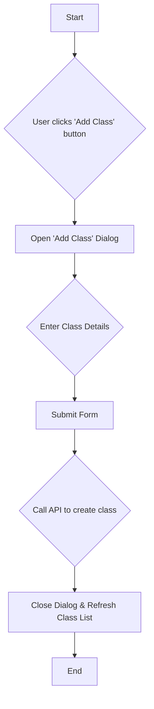

# Blueprint: Add Class Functionality

This document outlines the plan to implement the "Add Class" feature for the teacher role.

## 1. UI Changes

A dialog will be used to capture the new class information. This keeps the main management page clean and provides a focused user experience.

### File to Modify: `sih-final-main/src/app/teacher/(dashboard)/management/page.tsx`

- **Add Dialog Component:** I will import and use the `Dialog` component from `@/components/ui/dialog`.
- **State Management:** A new state variable, `isAddClassDialogOpen`, will be added to control the visibility of the dialog.
- **Form:** The dialog will contain a form with fields for `Class Name` and `Class Code`.
- **Button Logic:** The existing "Add Class" button will be updated to open the dialog.

### Mermaid Diagram

## 2. API Endpoint

A new API endpoint will be created to handle the creation of a new class.

### File to Create: `sih-final-main/src/app/api/class/create/route.ts`

- This endpoint will receive the `className` and `classCode` from the frontend.
- It will insert a new record into the `classes` table in the Supabase database.
- It will return the newly created class object or an error message.

## 3. QR Code Generation

Once a class is successfully created, a QR code will be generated. This will be handled in a separate step after the class creation is complete.